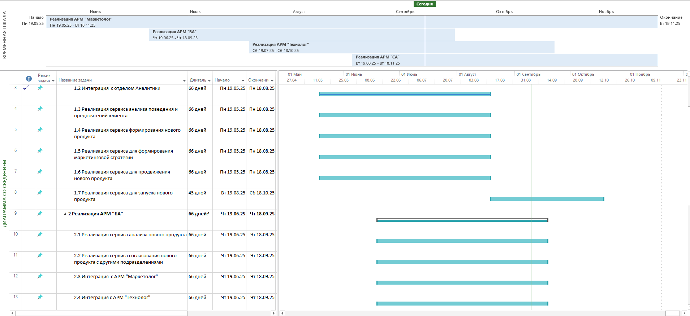
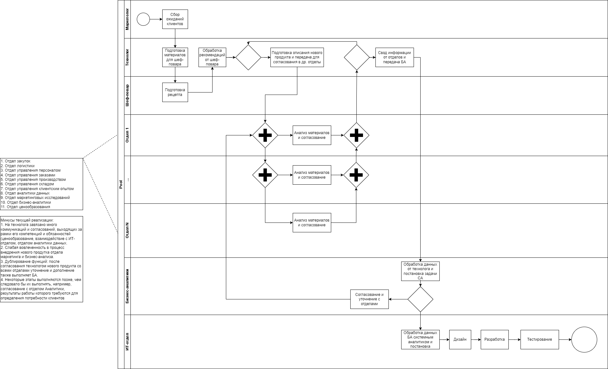
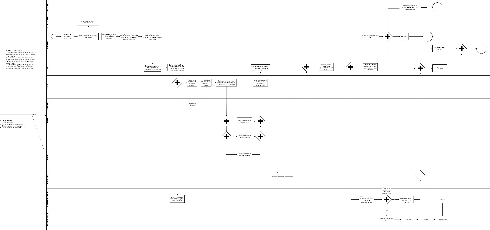
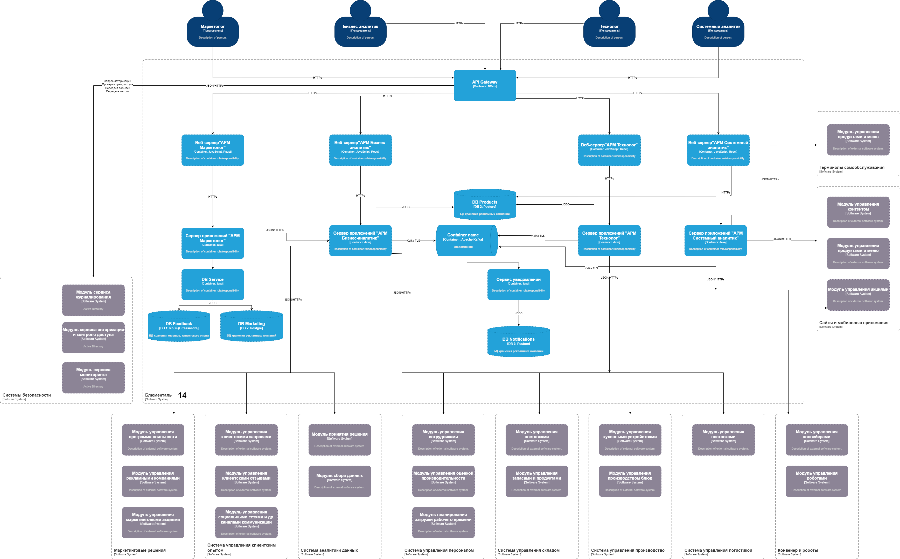

= Проект по разработке системы внедрения новых продуктов в сети столовых "Замысловатость"

== Общая информация
Настоящий документ содержит описание проектных решений для разработки и внедрения системы создания новых блюд

== Цели внедрения проекта
В рамках проектной работы требуется разработать систему для создания новых блюд "Блюменталь"

== Описание проекта

=== Ключевые задачи проекта
. Проанализировать цепочку бизнес-процесса, направленного на внедрение нового продукта в меню закусочных;
. Оптимизировать данный процесс;
. Организовать работу команды СА по внедрению оптимизированного процесса в существующую ИТ-систему.

image::images/Задачи.png[Задачи проекта]

=== ИТ-методолгию для разработки и внедрения и обоснование выбора

Выбрана методология Scrum по следующим причинам:

- планируется выполнение работы по спринтам;
- проект требует работы каждый раз над новыми задачами с большим количеством неизвестных, требующих детальной проработки;
- под проект будет выделена проектная команда, которая будет включать аналитика, дизайнера, фронтенд разработчика, бэкенд разработчика, тестировщика;
- каждая предметная область будет разделена на задачи, включенные в бэклог спринта.

=== Roadmap проекта
Реализация проекта должна осуществляться поблочно по мере автоматизации каждой предметной области

 

=== Команда проекта

.Планируемое количество
[cols="2*",options="header"]  
|=== 
|Должность|Количество
|Team Lead системных аналитиков|1
|Системный аналитик|4
|Дизайнер|1
|BE Разработчик|4
|FE Разработчик|4
|Тестировщик|2
|===

.Состояние команды системных аналитиков
[cols="5*",options="header"]  
|=== 
|Характеристики|Эйлер И.И.|Декарт М.М.|Остроградский Э.Э.|Ковалевская С.С.
|Личностные характеристики|
- целеустремленность

- обучаемость

- ответственность

- инициативность

- аналитическое мышление

- стремление к саморазвитию

- умение находить подход к людям|
- аккуратность

- внимательность

- грамотность

- ответственность

- умение находить подход к людям

- работа с большими объемами документации|
- аккуратность

- внимательность

- ответственность

- умение находить подход к людям

- аналитическое мышление|
- ответственность

- самостоятельность

- стремление к саморазвитию

|Уровень знаний предметной области, требований и нормативной документации заказчика|высокий|высокий|высокий|базовый 
|Уровень знаний технической части проекта:

- В области web и desktop разработки|базовый|базовый|высокий|базовый 

|- Архитектура проекта|средний|средний|высокий|базовый 

|- Работа с БД (проектирование БД, SQL-запросы)|средний|базовый|высокий|базовый 

|Стек технологий|UML, BPMN, DFD, ER, SQL, Use Case, Figma, Draw.io, Microsoft Office, GIT|BPMN, Visio, Microsoft Office|ER, SQL, Visio, Microsoft Office, GIT|Visio, Microsoft Office 
|Уровень специалиста в целом|Средний|Средний|Высокий|Базовый 
|Точки роста|Архитектура информационных систем,Основы Devops|Анализ и управление требованиями, прототипирование, проектирование БД, SQL-запросы|Анализ и управление требованиями|Анализ и управление требованиями, прототипирование, проектирование БД, SQL-запросы, нотации UML, BPMN,
разработка документации (виды и содержание)
|===

В связи с тем, что ПО для разных ролей пользователей разрабатывается не одновременно, разделение системных аналитиков по предметным областям не целесообразно. Принято решение разделить работу системных аналитиков по специфике выполняемых задач в рамках одной предметной области:

* сбор требований
* постановка задачи и подготовка макетов
* тестирование
* участие в приемке и демонстрация

=== Риски проекта
[options="header"]
|===
|Код риска|Фаза проекта|Описание риска|Возможные последствия риска|Ущерб|Вероятность|Величина риска|Мера реагирования|Мероприятия по снижению рискового события|План действий при возникновении риска|Срок реагирования|Ответственное за риск лицо
|Р1|Разработка|Возникновение ошибок в связи с различием структуры серверов БД между пром.средой и средой разработки|Дополнительные затраты на устранение ошибок|4|3|12|Минимизация|
1. Сбор данных о среде эксплуатации целевой системы

2. Тестирование настроек на максимально приближенной к пром.среде архитектуре|Оперативная отладка настроек в процессе настройки в среде эксплуатации|До начала приемки|Команда разработки
|Р2|Ввод в постоянную эксплуатацию|Несоблюдение сроков развертывания целевой системы в среде эксплуатации|Сдвиг сроков финальных работ по приемке системы, сокращение сроков на устранение возникающих ошибок|3|4|12|Минимизация, принятие|
1. Подготовка и согласование со всеми участниками плана работ с конкретными датами

2. Подготовка плана действий на случай возникших ошибок

3. Обозначение последствий сдвига сроков для участников
|Устранение возникших ошибок в согласованные сроки|-|Команда разработки, команда Devops
								
|Р3|Ввод в постоянную эксплуатацию|Возникновение ошибок в связи с разной конфигурацией клиентских рабочих станций, смежных систем|Дополнительные затраты на устранение ошибок|3|2|6|Минимизация|
1. Предварительное изучение конфигурации рабочих станций и смежных систем 

2. Тестирование настроек для разных конфигураций|Корректировка настроек в процессе возникновения ошибок|До начала приемки|Команда Devops
										
|Р4|Разработка|Наличие противоречивых требований, замечаний со стороны Заказчика|Увеличение сроков согласования документации и проектных решений, позднее начало разработки|4|4|16|Уклонение|-|
1. Анализ информации и выбор решения с учетом минимизации затрат. 

2. Проведение совместных встреч с руководством отделов|В кратчайшие сроки|Команда аналитиков
											
|Р5|Разработка|Обнаружение ошибок в ПО или документации|Дополнительные затраты на устранение текущих ошибок|2|2|4|Минимизация|
1. Детальная подготовка постановок по каждой задаче.

2. Подготовка методик тестирования

3. Погружение тестировщиков и разработчиков в предметную область|
1. Устранение ошибок в текущей реализации.

2. Учет ошибок в постановке задачи для разработчиков
|В кратчайшие сроки|	Команда аналитиков

|Р6|Разработка|Недоработки при проектировании функциональных и технических решений|Увеличение времени на доработку. Переделываение реализованного функционала|5|2|10|Минимизация, уклонение|
1. Подготовка общей архитектуры. 

2. Подготовка подробных технических и функциональных постановок, согласуемых с пользователями и командой поддержки ИТ-системы|
1. Выполнить проработку постановок с учетом обозначенных проблем.

2. Определить некритичные ошибки и устранить их в ходе дальнейшего сопровождения|-|
Команда аналитиков, команда разработки
|===

=== Описание выбранного решения

Для проектирования решения была подготовлена схема текущей реализации процесса внедрения новых блюд

В ходе выполнения данных работ были определены следующей минусы:

. На технолога завязано много коммуникаций и согласований, выходящих за рамки его компетенций и обязанностей (ценообразование, взаимодействие с ИТ-отделом, отделом аналитики данных.
. Слабая вовлеченность в процесс внедрения нового продутка отдела маркетинга и бизнес-анализа.
. Дублирование функций: после согласования технологом нового продукта со всеми отделами уточнение и дополнение также выполняет БА.
. Некоторые этапы выполняются позже, чем следовало бы их выполнять, например, согласование с отделом Аналитики, результаты работы которого требуются для определения потребности клиентов

Целевое изменение текущего бизнес-процесса было направлено на:

. Равномерное распределение нагрузки по внедрению нового продукта между всеми участниками.
. Смещение акцента ответственности и контроля за внедрение нового продукта  с технолога на профильный отдел (отдел маркетинга).
. Исключение дублирования функций.
. Исключение команды разработки из процесса добавления нового продукта.

=== Описание архитектуры с НФТ

Архитектура в нотации С4 (контейнеры).

Архитектура система построена с учетом следущего:

. Для реализации функций системы в пределах определенной предметной области создаются отдельные АРМы для каждой функциональной пользовательской роли.
. Работа данных АРМ планируется реализовать в сервисно-ориентированной архитектуре. 
. В архитектуру включен  компонент API Gateway для маршрутизации, агрегации данных, управления доступом, управления трафиком и мониторинга и логирования
. Также при проектировании архитектуры требуется расширение функционала существующих Систем безопасности, так как в текущей ИТ-структуре не определены сервисы, реализующие функции авторизации, управления доступом и мониторинга работы.
. Сервисы АРМ Маркетолога потребуют соединения с двумя БД: реляционная для хранения данных о маркетинговых исследования и рекламных компаниях и нереляционная для хранения данных отзывов клиентов, соцсетей.
. Взаимодействие сервисов АРМ БА, Технолога и СА планируется осуществлять через брокер сообщений Кафка для обеспечения согласования работы по внедрению нового блюда.
. Все сервисы взаимодействуют с модулями уже существующей ИТ-системы.

В ходе проведенной АТАМ-сессии определены следующие НФТ:

[options="header"]
|===
|Атрибут качества|Приоритет|НФТ
|Производительность.Время отклика|High|При открытии АРМ «Технолог» для просмотра большого списка продуктов или ингредиентов (например, больше 1000 позиций) время отклика не должно превышать 2 сек
|Масштабируемость.Отказоустойчивость|High|Пиковая нагрузка (запуск рекламы маркетологом) не должна приводить к падению сервисов
|Безопасность.Авторизация|High|Технолог не должен иметь доступа к данным о маркетинговых стратегиях в АРМ «Маркетолог»
|Сопровождаемость.Внесение изменений|Low|Изменение процесса согласования (добавление нового этапа) не должно требовать остановки всей системы
|Интегрируемость.Совместимость|Medium|Система должна обновлять статусы согласования реальном времени при изменении
|Надежность.Доступность|Medium|Падение сервиса для запуска нового продукта не должно блокировать работу маркетолога
|Юзабилити.Эффективность использования|Low|Интерфейс АРМ «Маркетолог» должен позволять просмотреть все клиентские отзывы за три клика
|===

== Заключение

Реализация этого проекта позволит ускорить существующий процесс добавления новых блюд, а также понизить трудозатраты всех вовлеченных в процесс специалистов 