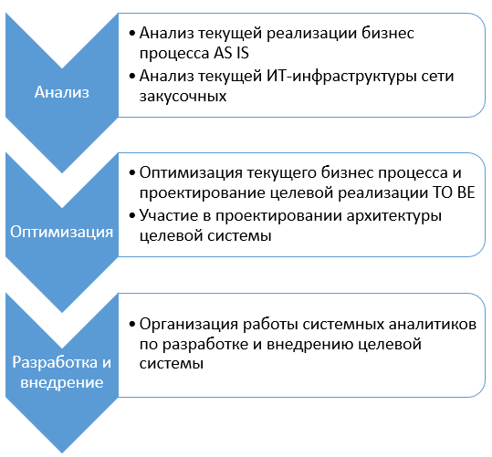

= Проект по разработке системы внедрения новых продуктов в сети столовых "Замысловатость"

== Общая информация
Настоящий документ содержит описание процесса разработки и внедрения новой системы создания новых блюд

== Цели внедрения проекта
В рамках проектной работы требуется разработать систему для создания новых блюд "Блюменталь"

== Описание проекта

=== Ключевые задачи проекта
. проанализировать цепочку бизнес-процесса, направленного на внедрение нового продукта в меню закусочных;
. оптимизировать данный процесс;
. организовать работу команды СА по внедрению оптимизированного процесса в существующую ИТ-систему.

=== ИТ-методолгию для разработки и внедрения и обоснование выбора

Выбрана методология Scrum по следующим причинам:

- Планируется выполнение работы по спринтам;
- проект требует работы каждый раз над новыми задачами с большим количеством неизвестных, требующих детальной проработки;
- под проект будет выделена проектная команда, которая будет включать аналитика, фронтенд разработчика, бэкенд разработчика, тестировщика;
- каждая предметная область будет разделена на задачи, включенные в бэклог спринта.

== Roadmap проекта

image::images/Roadmap.png[Roadmap проекта]

== Команда проекта

.Команда проекта
[cols="2*",options="header"]  
|=== 
|Должность|Количество
|Team Lead системных аналитиков|1
|Системный аналитик|1
|BE Разработчик|1
|FE Разработчик|1
|Тестировщик|1
|===

== Риски проекта

В данном разделе привести анализ и план-структуру возможных рисков.

== Описание выбранного решения

Необходимо заполнить данный раздел

== Описание архитектуры с НФТ

Вставить изображение архитектуры с пояснениями.

В связи с решением о применении в организации ISO/IEC 27001 для безопасности данных было принято решение реализовать применение НФТ в сервисе с наиболее чувствительными данными - сервисе "Система управления заказами"

.Нефункциональные требования
[options="header"]
|===
|Требование |Атрибут 
|Доступность	| 
|Минимальное время простоя	| 
|Быстрый доступ к системе	| 
|Быстродействие	|  
|Отзывчивость системы	| 
|Минимальное время ответа на запрос	|   
|Количество ошибок	|  
|Время восстановления после отказа системы	| 
|Защита от сбоев	|  
|Добавление новых точек входа для создания заказов	|  
|Горизонтальное масштабирование (увеличение мощности при увеличении количества заказов)	|  
|Противостояние несанкционированному доступу	|  
|Целостность данных	|  
|===

== Заключение

Реализация этого проекта позволит ...